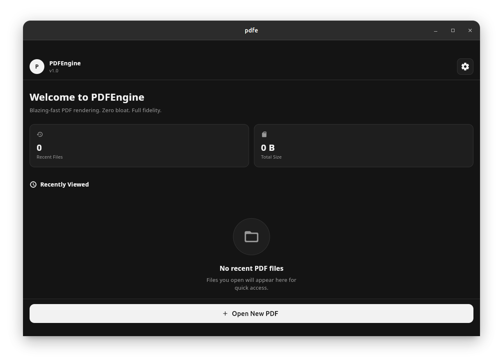

# PDFe - Blazing-fast PDF Experience

PDFe is a lightweight, high-performance PDF reader built for speed and fidelity. Designed with a focus on zero-bloat and maximum readability, it provides a premium reading experience across Android and iOS.

## ✨ Core Features

- **Blazing-Fast Performance:** Instant rendering of complex PDFs using the high-performance `pdfrx` engine.
- **Customizable Reading Modes:** Switch between **Light**, **Dark**, and **Sepia** modes to suit your environment and eye comfort.
- **Seamless Document Handling:** Effortlessly open, pick, and share PDF files directly from your device.
- **Intelligent Recovery:** Remembers exactly where you left off in every document.
- **Bookmark System:** Save important pages for quick access later.

## 🛠️ How it Works

PDFe is built using the **Flutter** framework, ensuring a consistent and fluid experience on all platforms. 

### High-Fidelity Rendering
Unlike standard viewers that struggle with large files, PDFe utilizes a native-level rendering pipeline to ensure that even the most complex documents are displayed with pixel-perfect accuracy.

### Adaptive Theming
The app's logic automatically adapts the user interface to match your preferred reading mode, providing a cohesive visual experience whether you're reading in direct sunlight or late at night.

## 🚀 Getting Started

Simply open any PDF file on your device, and select **PDFe** to enjoy a superior reading experience.

---
Built with ❤️ using Flutter and Dart.
